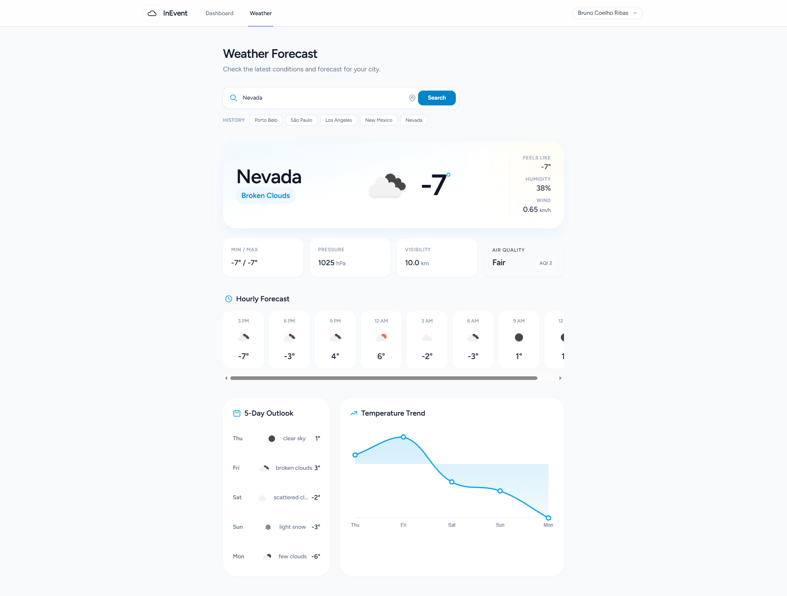

# InEvent Weather Challenge

A modern, full-stack weather application built with **Laravel 12** and **Vue 3**, featuring real-time data, geolocation, interactive charts, and search history.



## Tech Stack

* **Backend:** PHP 8.4, Laravel 12, SQLite, Service Layer Pattern.
* **Frontend:** Vue 3 (Composition API), Inertia.js, Tailwind CSS.
* **Integrations:** OpenWeather API, Chart.js, Browser Geolocation API.
* **Testing:** PHPUnit.

## Key Features

* **Real-time Weather:** current conditions, AQI (Air Quality), and detailed metrics.
* **Smart Forecasting:** next 24h hourly timeline & 5-day daily outlook.
* **Data Visualization:** dynamic temperature trend chart using Chart.js.
* **Geolocation:** "use my location" feature.
* **History:** persisted search history per user.

## Getting Started

Follow these steps to set up the project locally.

### Prerequisites
* PHP 8.2 or higher
* Composer
* Node.js & NPM

### Installation

1.  **Clone the repository**
    ```bash
    git clone [https://github.com/brunocoelhoribas/inevent-weather.git](https://github.com/brunocoelhoribas/inevent-weather.git)
    cd inevent-weather
    ```

2.  **Install Dependencies**
    ```bash
    composer install
    npm install
    ```

3.  **Environment Setup**
    ```bash
    cp .env.example .env
    php artisan key:generate
    ```

4.  **Database Setup (SQLite)**
    On Linux/Mac:
    ```bash
    touch database/database.sqlite
    ```
    On Windows (PowerShell):
    ```powershell
    New-Item -ItemType File database/database.sqlite
    ```

    Then run migrations and seed:
    ```bash
    php artisan migrate --seed
    ```

5.  **API Key Configuration**
    Open your `.env` file and add your OpenWeather API Key:
    ```env
    OPENWEATHER_API_KEY=your_api_key
    ```

6.  **Run the Application**
    You will need two terminals:

    Terminal 1 (Backend):
    ```bash
    php artisan serve
    ```

    Terminal 2 (Frontend):
    ```bash
    npm run dev
    ```

Visit `http://127.0.0.1:8000` in your browser.

## Running Tests

To execute the Unit and Feature tests:

```bash
php artisan test
